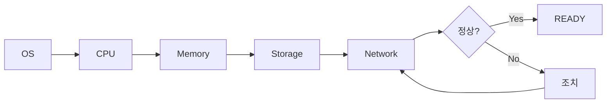
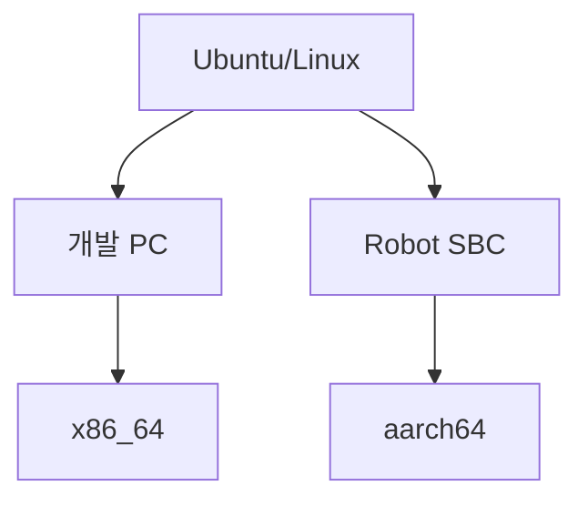
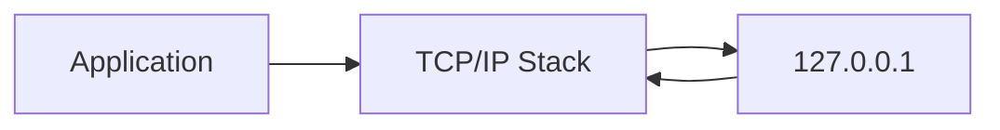
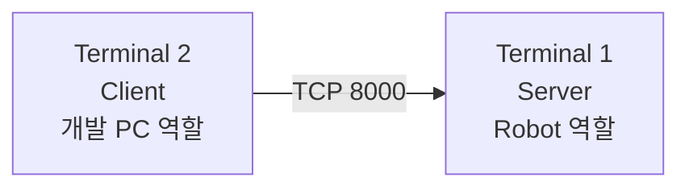
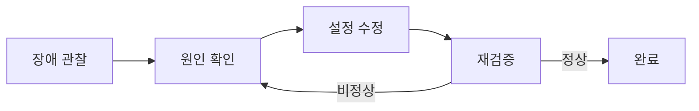
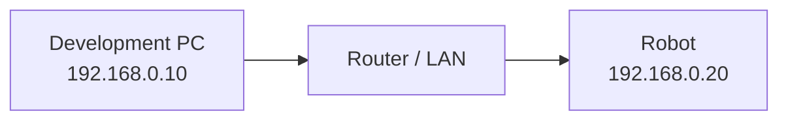

# ④ 학생용 Workbook — 로봇 소프트웨어 설치 전 환경 점검

이름: ____________________  날짜: ____________________

관련 슬라이드: **3-2, 12, 13, 14, 14-2**

## 오늘의 미션

> **이 개발 PC에 로봇 소프트웨어를 설치해도 되는가?**



---

## Mission 1 — WSL 2 / Ubuntu 22.04 확인

### 1-1. PowerShell

```powershell
wsl -l -v
```

기록:

| 항목 | 결과 |
|---|---|
| Ubuntu-22.04 존재 | □ Yes □ No |
| STATE | __________ |
| VERSION | __________ |

정상 기준: `Ubuntu-22.04`, `VERSION 2`

### 1-2. Ubuntu 실행

```powershell
wsl -d Ubuntu-22.04
```

- [ ] 실행 성공
- [ ] 실행 실패

---

## Mission 2 — OS 확인

```bash
lsb_release -a
```

| 항목 | 나의 결과 | 정상 기준 |
|---|---|---|
| Release | __________ | 22.04 |
| Codename | __________ | jammy |

판정: □ 정상 □ 확인 필요

---

## Mission 3 — CPU 아키텍처 확인

```bash
uname -m
```

나의 결과: `________________`



### 확인 문제

같은 Ubuntu라면 PC용 설치 이미지를 Jetson에 그대로 사용해도 되는가?

- [ ] Yes
- [ ] No

이유: ________________________________________________

---

## Mission 4 — Memory 확인

```bash
free -h
```

`free`보다 **available** 값을 확인합니다.

| 항목 | 결과 |
|---|---|
| Total | __________ |
| Available | __________ |
| Swap | __________ |

상태: □ 충분 □ 확인 필요 □ 부족

---

## Mission 5 — Storage 확인

```bash
df -h /
```

| 항목 | 결과 |
|---|---|
| Avail | __________ |
| Use% | __________ % |

현재 상태에 표시합니다.

```text
0% ------------ 50% ------------ 80% ------ 90% ------ 100%
      여유                    확인             위험
```

### Trouble Check

`Use% = 99%`라면 가장 먼저 무엇을 해야 하는가?

1. __________________________________
2. __________________________________
3. __________________________________

필요 시 큰 파일 확인:

```bash
du -sh ~/* 2>/dev/null
```

재검증:

```bash
df -h /
```

---

## Mission 6 — Network interface 확인

```bash
ip addr
```

세 가지만 찾습니다.

```text
① Interface
② State UP/DOWN
③ IPv4
```

| 항목 | 결과 |
|---|---|
| Interface | __________ |
| State | __________ |
| IPv4 | __________ |

---

## Mission 7 — 내 PC의 TCP/IP 확인

```bash
ping -c 4 127.0.0.1
```

| 항목 | 결과 |
|---|---|
| transmitted | ______ |
| received | ______ |
| packet loss | ______ % |

> `127.0.0.1`은 로봇이 아니라 **현재 PC 자신**입니다.



---

## Mission 8 — 한 PC에서 Robot 통신 모의 실습

Ubuntu Terminal을 2개 엽니다.



### Terminal 1 — Robot 역할

```bash
mkdir -p ~/network_lab
cd ~/network_lab
echo "ROBOT NETWORK OK" > index.html
python3 -m http.server 8000
```

확인:

```text
Serving HTTP on 0.0.0.0 port 8000
```

### Terminal 2 — Development PC 역할

```bash
curl http://127.0.0.1:8000
```

응답: `______________________________`

판정: □ 성공 □ 실패

---

## Mission 9 — 장애 주입

잘못된 Port를 사용합니다.

```bash
curl http://127.0.0.1:9000
```

결과: ________________________________________________

| 확인 항목 | Server | Client | 일치? |
|---|---:|---:|---|
| IP | 127.0.0.1 | 127.0.0.1 | □ |
| Port | 8000 | 9000 | □ |

원인: ________________________________________________

### 복구

```bash
curl http://127.0.0.1:8000
```

재검증 결과: □ 정상 □ 비정상



---

## Mission 10 — 실제 Robot과 연결해서 생각하기

이번 실습:

```text
Client → 127.0.0.1 → 같은 PC의 Server
```

실제 환경:



실제 로봇에서 확인 예:

```bash
ping -c 4 192.168.0.20
```

### 핵심

- 이번 실습의 대상: `127.0.0.1`
- 실제 로봇의 대상: `Robot IP`
- 확인 원리: **같음**

---

## Mission 11 — 개발 PC와 Robot 비교

| 항목 | 개발 PC | Robot SBC |
|---|---|---|
| OS 확인 | 필요 | 필요 |
| CPU 확인 | 필요 | 필요 |
| Memory 확인 | 필요 | 필요 |
| Storage 확인 | 필요 | 필요 |
| Network 확인 | 필요 | 필요 |
| CPU | 보통 x86_64 | 보통 aarch64 |
| 설치 | WSL/USB | SD/eMMC/NVMe Image |
| Driver | PC 장치 | Robot/Sensor/Motor |

### 한 문장 정리

공통점: ________________________________________________

차이점: ________________________________________________

---

## Mission 12 — Robot 환경 판정

다음 결과를 확인합니다.

```text
Ubuntu       : 20.04
Architecture : aarch64
Memory       : 4 GB
Storage Use  : 91%
Interface    : UP
IP           : 192.168.0.20
```

바로 설치할 것인가?

- [ ] 설치 진행
- [ ] 먼저 조치

가장 먼저 확인할 항목: ________________________________

조치: ________________________________________________

재검증 명령: __________________________________________

---

## Mission 13 — Evidence 수집

패키지 루트에서:

```bash
chmod +x evidence/*.sh
./evidence/collect_developer_evidence.sh
```

생성 경로:

```text
results/YYYYMMDD_HHMMSS/
├── evidence.json
└── evidence.md
```

나의 결과:

- Decision: □ READY □ NOT_READY
- Failed check: ________________________________________

---

# 최종 Installation Readiness Check

| 점검 | 결과 | 판정 |
|---|---|---|
| WSL2 | ______ | 🟢 / 🟡 / 🔴 |
| Ubuntu | ______ | 🟢 / 🟡 / 🔴 |
| Architecture | ______ | 🟢 / 🟡 / 🔴 |
| Memory | ______ | 🟢 / 🟡 / 🔴 |
| Storage | ______ | 🟢 / 🟡 / 🔴 |
| Network | ______ | 🟢 / 🟡 / 🔴 |
| Ping | ______ | 🟢 / 🟡 / 🔴 |
| TCP | ______ | 🟢 / 🟡 / 🔴 |

최종 판단:

- [ ] **READY — 설치 진행 가능**
- [ ] **NOT READY — 조치 후 재검증**

판단 근거:

_______________________________________________________

_______________________________________________________

---

## 실습 종료

Server Terminal:

```text
Ctrl + C
```

Ubuntu:

```bash
exit
```

필요 시 PowerShell:

```powershell
wsl --shutdown
```

## 기억할 문장

> **설치 명령보다 먼저, 설치할 환경이 준비되어 있는지 확인한다.**
