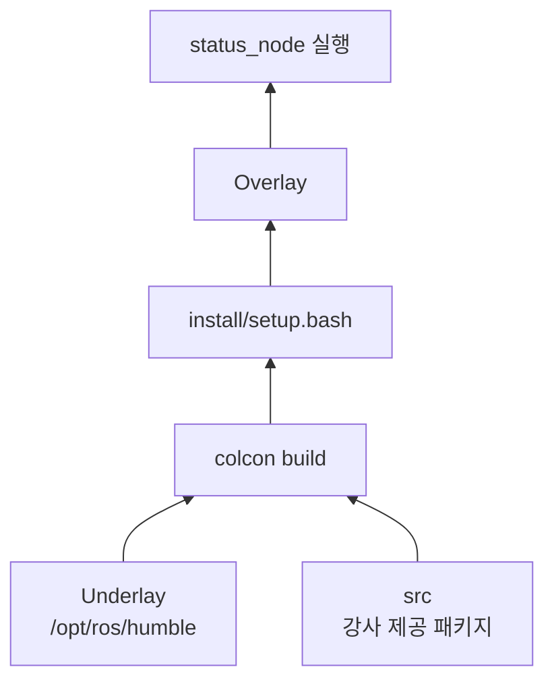
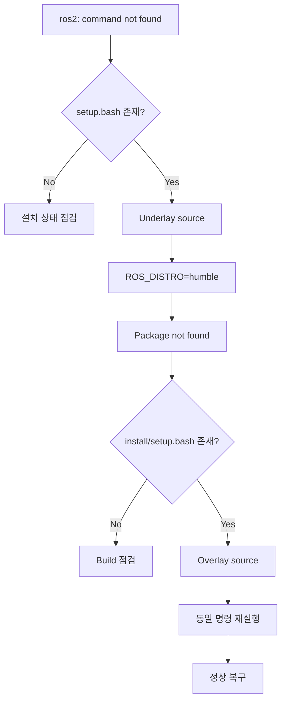
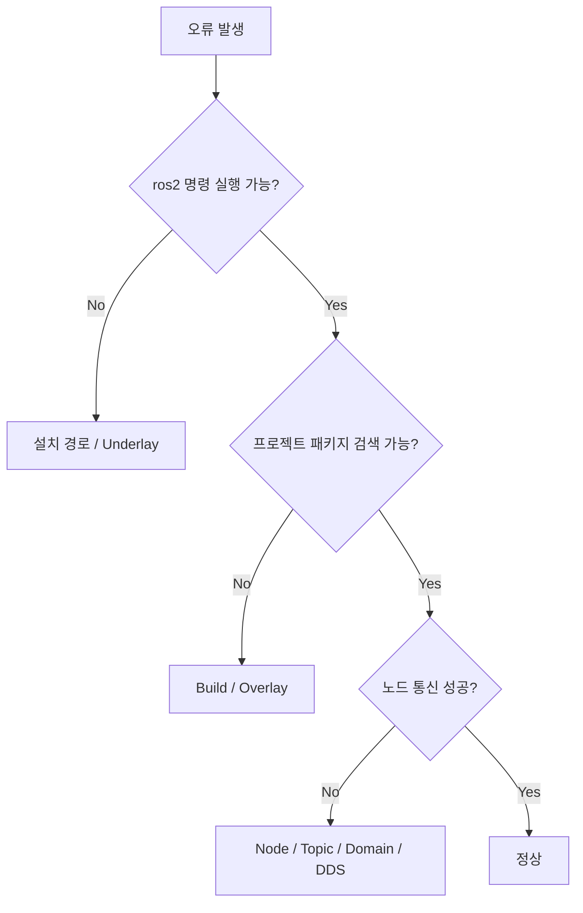
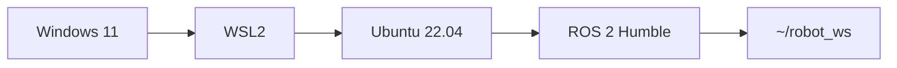

# 3회차 실습 워크북
## ROS 2 Humble 설치 상태 검증과 오류 복구

**대응 슬라이드:** 10, 11, 12, 13, 14, 15, 15-2  
**기준 환경:** Ubuntu 22.04 + ROS 2 Humble  
**실습 방식:** 강사 제공 패키지를 활용하여 설치·환경·빌드·통신·복구 과정을 검증한다.

---

# 0. 실습 구조

이번 실습은 슬라이드 하나당 하나의 실습 단위로 구성한다.

| 실습 단위 | 대응 슬라이드 | 핵심 질문 | 완료 증거 |
|---|---:|---|---|
| 실습 1 | 10 | 무엇을 어떤 순서로 검증하는가? | 환경 체크표 |
| 실습 2 | 11 | 기본 ROS 2 환경은 정상인가? | `ROS_DISTRO=humble`, `ros2 --help` |
| 실습 3 | 12 | 강사 제공 패키지를 빌드하고 Overlay로 사용할 수 있는가? | build 성공, 패키지 검색, `status_node` 실행 |
| 실습 4 | 13 | ROS 2 노드가 실제 메시지를 주고받는가? | Talker/Listener + node/topic 결과 |
| 실습 5 | 14 | 환경 오류를 어떻게 재현하고 복구하는가? | 오류 → 복구 → 동일 명령 재검증 |
| 실습 6 | 15 | 대표 오류를 어느 계층에서 점검해야 하는가? | 오류 진단 기록표 |
| 참고 실습 | 15-2 | WSL2와 Jetson Nano는 무엇이 다른가? | 환경 준비 체크 |

## 전체 흐름


> **실습 원칙:** 명령어 실행 자체가 목적이 아니다.  
> 각 단계에서 **무엇을 확인하는지 → 정상 결과가 무엇인지 → 오류일 때 어디를 점검하는지**를 기록한다.

---

# 실습 1. 시연 시나리오 준비
## 대응 슬라이드 10

### 1. 목표
실습 전체 구조와 터미널별 역할을 이해한다.

### 2. 사용할 터미널

```text
터미널 A : Talker 실행
터미널 B : Listener 실행
터미널 C : node/topic 상태 확인
별도 터미널 : Build 및 오류 재현
```

### 3. 시작 전 체크

```text
□ Ubuntu 22.04이다.
□ ROS 2 Humble 설치가 완료되어 있다.
□ 강사가 제공한 maintenance_check_pkg를 받았다.
□ ~/robot_ws를 사용할 수 있다.
□ 터미널을 3개 이상 열 수 있다.
```

### 4. 실습 환경 기록

| 항목 | 학생 기록 |
|---|---|
| 장비 종류 | |
| Ubuntu 버전 | |
| CPU 아키텍처 | |
| ROS 2 배포판 | |
| 실습 시작 시각 | |

### 5. 완료 조건
모든 시작 조건을 확인한 후 실습 2로 이동한다.

---

# 실습 2. 운영체제와 ROS 2 환경 확인
## 대응 슬라이드 11

### 1. 목표
**설치 파일이 존재하는 것**과 **현재 터미널에 ROS 2 환경이 적용된 것**을 구분해서 확인한다.

## STEP 1. Ubuntu 확인

```bash
lsb_release -a
```

정상 기준:

```text
Release: 22.04
Codename: jammy
```

CPU 아키텍처 확인:

```bash
uname -m
```

대표 결과:

```text
Desktop PC : x86_64
ARM64 SBC  : aarch64
```

## STEP 2. ROS 2 설치 파일 확인

```bash
ls /opt/ros
```

정상:

```text
humble
```

```bash
ls /opt/ros/humble/setup.bash
```

정상:

```text
/opt/ros/humble/setup.bash
```

## STEP 3. 현재 터미널에 Humble 적용

```bash
source /opt/ros/humble/setup.bash
```

## STEP 4. 환경 변수 확인

```bash
printenv ROS_DISTRO
```

정상:

```text
humble
```

## STEP 5. ROS 2 CLI 확인

```bash
ros2 --help
```

정상 기준:
`node`, `topic`, `pkg`, `run` 등의 하위 명령이 출력된다.

### 시각화

```mermaid
flowchart TD
    A[Ubuntu 22.04?] -->|Yes| B[/opt/ros/humble 존재?]
    B -->|Yes| C[source setup.bash]
    C --> D[ROS_DISTRO=humble?]
    D -->|Yes| E[ros2 --help]
    E --> F[기본 ROS 2 환경 정상]
```

### 결과 기록

| 확인 항목 | 결과 | 판정 |
|---|---|---|
| Ubuntu Release | | □ 정상 □ 오류 |
| Codename | | □ 정상 □ 오류 |
| Architecture | | |
| `/opt/ros/humble` | | □ 정상 □ 오류 |
| `ROS_DISTRO` | | □ 정상 □ 오류 |
| `ros2 --help` | | □ 정상 □ 오류 |

### 제출 증거
- `printenv ROS_DISTRO`
- `ros2 --help`

---

# 실습 3. 워크스페이스 빌드와 Overlay 적용
## 대응 슬라이드 12

### 1. 목표
강사가 제공한 패키지를 학생이 **작성하지 않고 그대로 배치**하여  
`배치 → 인식 → 빌드 → Overlay → 검색 → 실행` 흐름을 검증한다.

## STEP 1. 워크스페이스 준비

```bash
mkdir -p ~/robot_ws/src
```

강사가 제공한 폴더 전체를 다음 위치에 복사한다.

```text
~/robot_ws/src/maintenance_check_pkg
```

파일 확인:

```bash
find ~/robot_ws/src/maintenance_check_pkg -maxdepth 2 -type f
```

필수 파일:

```text
package.xml
setup.py
setup.cfg
maintenance_check_pkg/status_node.py
```

> 이 실습에서는 소스 코드를 작성·수정하지 않는다.

## STEP 2. Underlay 적용

```bash
source /opt/ros/humble/setup.bash
```

## STEP 3. 패키지 인식 확인

```bash
cd ~/robot_ws
colcon list
```

정상 결과에:

```text
maintenance_check_pkg
```

가 포함되어야 한다.

## STEP 4. 패키지 빌드

```bash
colcon build --packages-select maintenance_check_pkg
```

정상:

```text
Starting >>> maintenance_check_pkg
Finished <<< maintenance_check_pkg
Summary: 1 package finished
```

## STEP 5. 빌드 결과 확인

```bash
ls ~/robot_ws
```

정상:

```text
build  install  log  src
```

```bash
ls ~/robot_ws/install/setup.bash
```

## STEP 6. Overlay 적용

```bash
source ~/robot_ws/install/setup.bash
```

## STEP 7. 패키지 검색

```bash
ros2 pkg list | grep maintenance_check_pkg
```

정상:

```text
maintenance_check_pkg
```

설치 위치:

```bash
ros2 pkg prefix maintenance_check_pkg
```

## STEP 8. 제공된 노드 실행

```bash
ros2 run maintenance_check_pkg status_node
```

정상:

```text
[INFO] [status_node]: Maintenance environment check started.
[INFO] [status_node]: ROS 2 environment is ready.
```

### 구조 시각화



### 결과 기록

| 확인 항목 | 결과 |
|---|---|
| 강사 제공 패키지 배치 | □ |
| `colcon list` | □ 성공 |
| Build | □ 성공 □ 실패 |
| `install/setup.bash` | □ 존재 |
| Overlay | □ 적용 |
| Package 검색 | □ 성공 |
| `status_node` | □ 정상 |

### 제출 증거
1. `Summary: 1 package finished`
2. `ros2 pkg prefix maintenance_check_pkg`
3. `ROS 2 environment is ready.`

---

# 실습 4. 노드 실행과 통신 검증
## 대응 슬라이드 13

### 1. 목표
노드가 실행된다는 사실뿐 아니라 **발행자와 구독자가 실제로 연결되고 데이터가 전달되는지** 확인한다.

### 통신 구조

```mermaid
flowchart LR
    T[Talker<br/>demo_nodes_cpp]
    C[/chatter<br/>std_msgs/msg/String]
    L[Listener<br/>demo_nodes_py]

    T -->|Publish| C -->|Subscribe| L
```

## STEP 1. 터미널 A — Talker

```bash
source /opt/ros/humble/setup.bash
ros2 run demo_nodes_cpp talker
```

정상:

```text
Publishing: 'Hello World: ...'
```

터미널 A는 종료하지 않는다.

## STEP 2. 터미널 B — Listener

```bash
source /opt/ros/humble/setup.bash
ros2 run demo_nodes_py listener
```

정상:

```text
I heard: [Hello World: ...]
```

터미널 B도 종료하지 않는다.

## STEP 3. 터미널 C — 노드 확인

```bash
source /opt/ros/humble/setup.bash
ros2 node list
```

정상:

```text
/listener
/talker
```

## STEP 4. 토픽 확인

```bash
ros2 topic list
```

`/chatter`가 있는지 확인한다.

```bash
ros2 topic info /chatter
```

정상:

```text
Type: std_msgs/msg/String
Publisher count: 1
Subscription count: 1
```

## STEP 5. 데이터 직접 확인

```bash
ros2 topic echo /chatter
```

몇 개의 메시지를 확인한 뒤 `Ctrl+C`.

## STEP 6. 주기 확인

```bash
ros2 topic hz /chatter
```

약 1 Hz인지 확인한다.

### 통신 완료 체크

```text
□ Talker Publishing 확인
□ Listener I heard 확인
□ /talker 확인
□ /listener 확인
□ /chatter 확인
□ Publisher count = 1
□ Subscription count = 1
□ topic echo로 실제 데이터 확인
```

### 제출 증거
- Talker
- Listener
- `ros2 topic info /chatter`

---

# 실습 5. 환경 설정 오류 재현과 복구
## 대응 슬라이드 14

### 1. 목표
`ros2: command not found`와 `Package not found`를 직접 재현하고,
오류가 발생한 계층을 구분해 복구한다.

## STEP 1. ROS 환경이 없는 셸 생성

```bash
env -i \
HOME="$HOME" \
USER="$USER" \
PATH=/usr/local/sbin:/usr/local/bin:/usr/sbin:/usr/bin:/sbin:/bin \
bash --noprofile --norc
```

## STEP 2. ROS_DISTRO 확인

```bash
printenv ROS_DISTRO
```

예상:

```text
출력 없음
```

## STEP 3. 오류 재현

```bash
ros2 node list
```

예상:

```text
bash: ros2: command not found
```

## STEP 4. 설치 문제인지 확인

```bash
ls /opt/ros/humble/setup.bash
```

파일이 있으면:

```text
설치 파일 존재
→ 환경 미적용 가능성이 높음
```

## STEP 5. Underlay 복구

```bash
source /opt/ros/humble/setup.bash
```

```bash
printenv ROS_DISTRO
```

정상:

```text
humble
```

```bash
ros2 --help
```

## STEP 6. Overlay 오류 재현

```bash
ros2 run maintenance_check_pkg status_node
```

예상:

```text
Package 'maintenance_check_pkg' not found
```

## STEP 7. Overlay 파일 확인

```bash
ls ~/robot_ws/install/setup.bash
```

## STEP 8. Overlay 복구

```bash
source ~/robot_ws/install/setup.bash
```

## STEP 9. 패키지 검색

```bash
ros2 pkg list | grep maintenance_check_pkg
```

## STEP 10. 동일 명령으로 재검증

```bash
ros2 run maintenance_check_pkg status_node
```

정상:

```text
ROS 2 environment is ready.
```

### 오류 복구 흐름



### 학생 기록

| 단계 | 증상/결과 | 판단 |
|---|---|---|
| 환경 미적용 | | |
| 설치 파일 확인 | | |
| Underlay 복구 | | |
| Overlay 미적용 | | |
| Overlay 복구 | | |
| 재검증 | | |

### 제출 증거
**오류 화면 + 동일 명령 복구 성공 화면**을 한 세트로 제출한다.

---

# 실습 6. 대표 오류 점검표 적용
## 대응 슬라이드 15

### 1. 목표
오류 메시지를 외우는 대신 **오류가 발생한 계층을 먼저 판단**한다.

### 오류 진단 지도



### 대표 점검표

| 증상 | 우선 점검 단계 | 확인 명령/항목 |
|---|---|---|
| `Unable to locate package` | 저장소 | `sudo apt update` |
| `/opt/ros/humble` 없음 | 설치 | `ls /opt/ros` |
| `ros2: command not found` | Underlay | `setup.bash` |
| `ROS_DISTRO` 없음 | 환경 | `source`, `printenv` |
| `Package not found` | Build/Overlay | `colcon list`, `install/setup.bash` |
| `colcon build` 실패 | Build | 최초 ERROR/Traceback |
| Listener 수신 없음 | 통신 | node/topic/Domain/DDS |

## 진단 기록

| 항목 | 학생 작성 |
|---|---|
| 오류 명령 | |
| 오류 메시지 | |
| 발생 단계 | |
| 정상이어야 할 결과 | |
| 확인한 증거 | |
| 원인 | |
| 조치 | |
| 재검증 명령 | |
| 최종 결과 | |

### 완료 조건
최소 한 건의 오류에 대해 다음을 모두 작성한다.

```text
증상 → 발생 단계 → 증거 → 원인 → 조치 → 동일 명령 재검증
```

---

# 참고 실습. 실습 환경 준비
## 대응 슬라이드 15-2

## A. Windows 사용자 — WSL2

### 구조



관리자 PowerShell:

```powershell
wsl --install
```

Ubuntu 22.04:

```powershell
wsl --install -d Ubuntu-22.04
```

확인:

```powershell
wsl --list --verbose
```

WSL Ubuntu에서:

```bash
lsb_release -a
```

권장 워크스페이스:

```text
~/robot_ws
```

---

## B. myAGV Jetson Nano — 제조사 시스템 이미지

이 환경은 Humble 실습과 다르다.

| Desktop PC | myAGV Jetson Nano |
|---|---|
| Ubuntu 22.04 | Ubuntu 20.04 |
| ROS 2 Humble | ROS 2 Galactic |
| 개발·검증 | 로봇 실행 |
| apt 기반 구성 | 제조사 시스템 이미지 |

제조사 이미지 파일:

```text
myAGV2023_ubuntu_V20240103_20.04JN_aarch64_shrunk.img.gz
```

다운로드:

```text
https://download-elephantrobotics.oss-cn-shenzhen.aliyuncs.com/Product_software/iMage-ISO/myAGV/myAGV2023_ubuntu_V20240103_20.04JN_aarch64_shrunk.img.gz
```

### microSD 준비 흐름


주의:

```text
□ microSD 기존 데이터 백업
□ 정확한 대상 장치 확인
□ Flash 중 카드 제거 금지
□ Validate 완료 후 안전하게 제거
```

4회차에서 확인:

```bash
lsb_release -a
printenv ROS_DISTRO
```

목표 환경:

```text
Ubuntu 20.04
ROS_DISTRO=galactic
```

---

# 최종 제출물

| 대응 슬라이드 | 제출 증거 |
|---|---|
| 10 | 실습 환경 체크표 |
| 11 | `ROS_DISTRO=humble`, `ros2 --help` |
| 12 | Build 성공, package prefix, status_node |
| 13 | Talker, Listener, topic info |
| 14 | 오류 전 + 복구 후 동일 명령 |
| 15 | 오류 진단 기록표 |
| 15-2 | 선택 환경 준비 체크 |

---

# 최종 자기평가

```text
□ 설치와 환경 적용의 차이를 설명할 수 있다.
□ Underlay와 Overlay의 적용 순서를 설명할 수 있다.
□ 강사 제공 패키지를 빌드하고 실행할 수 있다.
□ Talker와 Listener 통신을 검증할 수 있다.
□ command not found를 보고 바로 재설치하지 않는다.
□ Package not found가 발생하면 Build와 Overlay를 점검할 수 있다.
□ 복구 후 동일한 명령으로 재검증할 수 있다.
□ 유지보수 결과를 기록할 수 있다.
□ Desktop PC와 myAGV Jetson Nano 환경 차이를 설명할 수 있다.
```
