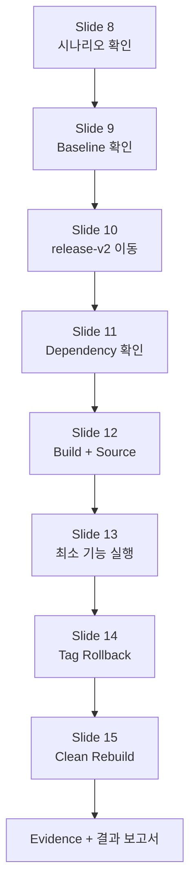
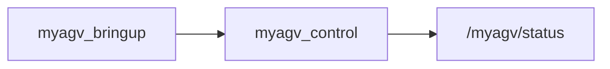
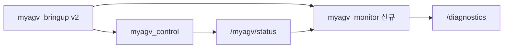
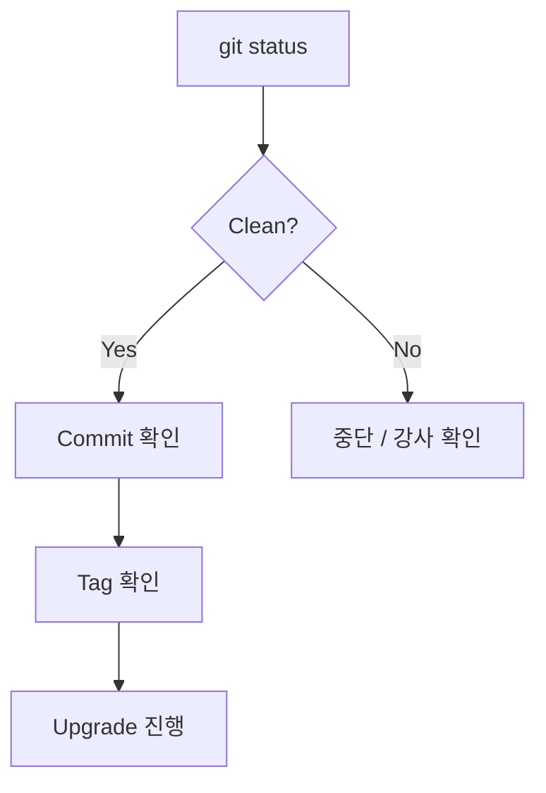
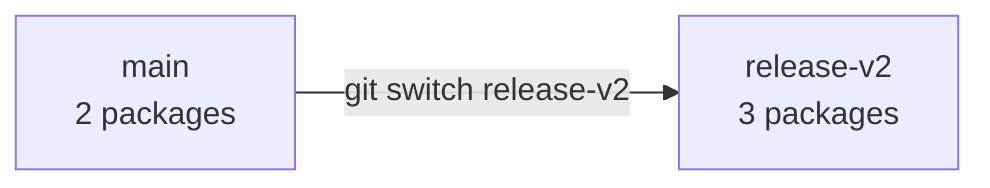
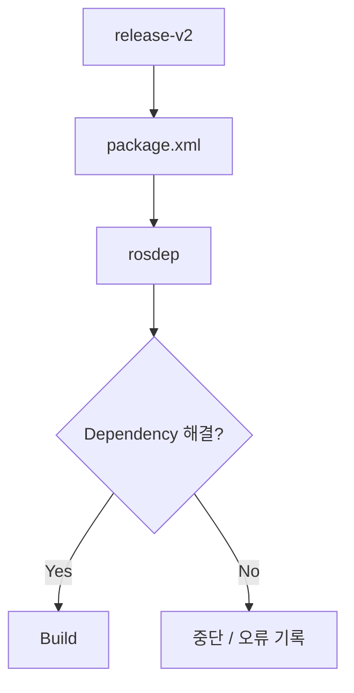
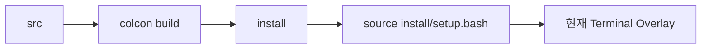
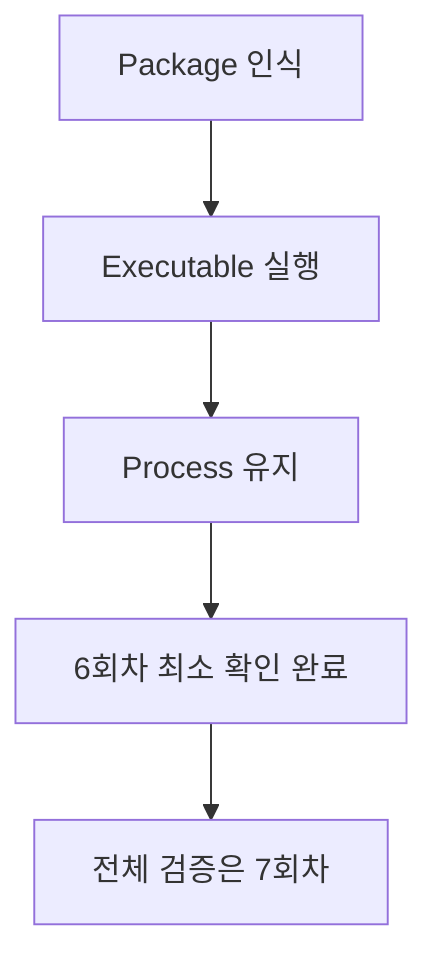
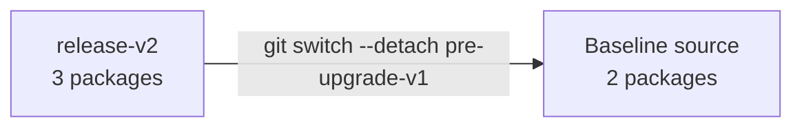
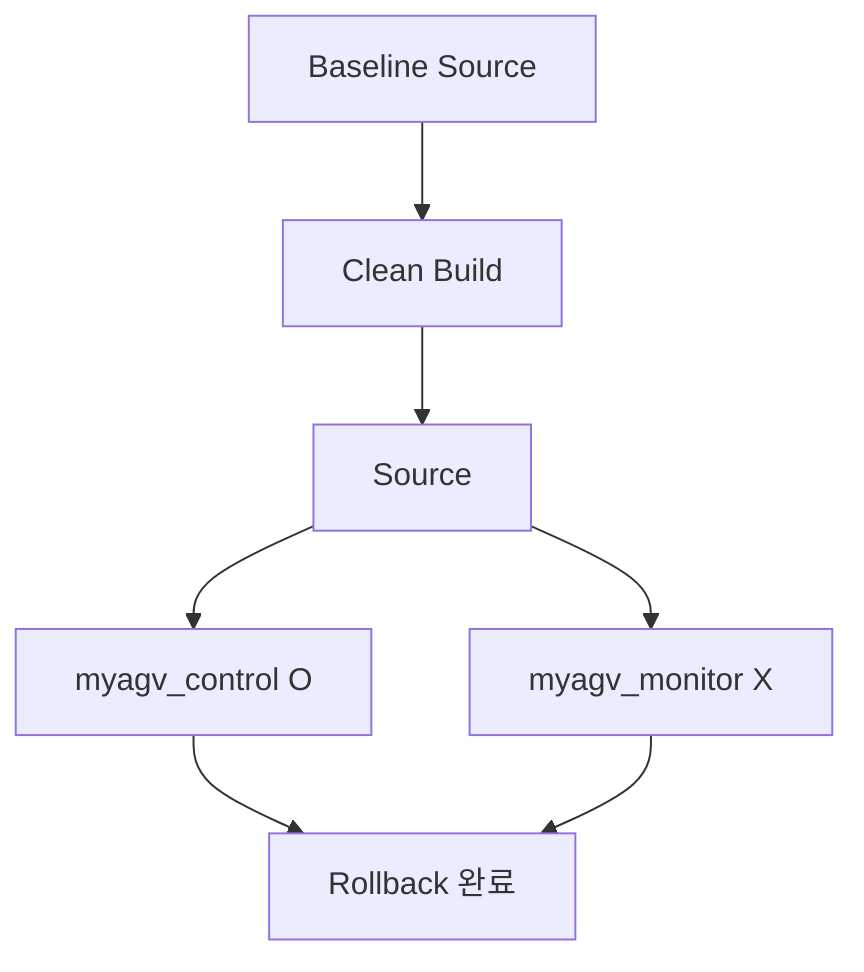

# Lab06 학생용 실습 Workbook
## Robot Application Upgrade & Rollback

### 실습 목표

1. `release-v2`로 이동하여 Dependency → Build → Source → 신규 모듈 최소 실행을 수행한다.
2. `pre-upgrade-v1`으로 Rollback하고 Clean Rebuild하여 실행 환경까지 Baseline으로 복원한다.

### 실습 환경

- Ubuntu 22.04
- ROS 2 Humble
- Git
- 저장소: `https://github.com/silverbjin/robot_sw_maintenance.git`
- 실제 로봇 하드웨어 연결 불필요

> `myagv_control`은 교육용 상태 발행 노드이며 실제 모터/시리얼 명령을 보내지 않습니다.

---

## 실습 전체 흐름



---

# 0. 실습 자료 받기

처음 한 번만 수행합니다.

```bash
cd ~

git clone --filter=blob:none --sparse \
https://github.com/silverbjin/robot_sw_maintenance.git

cd robot_sw_maintenance

git sparse-checkout set Lab06
git fetch --all --tags
```

확인:

```bash
ls Lab06
```

Git 명령은 다음 위치에서 수행합니다.

```bash
cd ~/robot_sw_maintenance
```

ROS 2 명령은 다음 위치에서 수행합니다.

```bash
cd ~/robot_sw_maintenance/Lab06/ros2_ws
```

---

# Slide 8 — 실습 시나리오 확인

## 목표
Baseline의 패키지 구성을 확인하고 Upgrade 후 변경될 범위를 이해한다.

```bash
cd ~/robot_sw_maintenance
git switch main
git status
ls Lab06/ros2_ws/src
```

예상:

```text
myagv_bringup
myagv_control
```

Baseline 구조:



Upgrade 후 구조:



기록:
- 현재 Branch: __________
- 현재 Package 수: __________
- 신규 예정 Package: __________

---

# Slide 9 — 변경 전 현재 상태 확인

```bash
cd ~/robot_sw_maintenance

git status
git log --oneline -5
git tag
git show pre-upgrade-v1 --no-patch
```

정상 조건:

- Working Tree가 Clean이다.
- `pre-upgrade-v1` Tag가 보인다.
- Baseline Commit을 확인할 수 있다.



> 변경 파일이 보이면 `git reset --hard`나 삭제를 임의로 수행하지 않습니다.

### Evidence 1 수집

```bash
Lab06/tools/collect_evidence.sh baseline ~/robot_sw_maintenance
```

---

# Slide 10 — Target Version 적용

```bash
git branch -a
git switch release-v2
```

처음 전환 시 자동 tracking이 되지 않으면:

```bash
git switch --track origin/release-v2
```

확인:

```bash
git status
ls Lab06/ros2_ws/src
```

예상:

```text
myagv_bringup
myagv_control
myagv_monitor
```



---

# Slide 11 — Dependency 확인

```bash
cd ~/robot_sw_maintenance/Lab06/ros2_ws

source /opt/ros/humble/setup.bash

rosdep install --from-paths src --ignore-src -r -y
```

`release-v2`의 `myagv_monitor`에는 `diagnostic_msgs` 의존성이 추가되어 있습니다.



Dependency가 해결되지 않았다면 다음 단계로 넘어가지 않습니다.

---

# Slide 12 — Build + Source

```bash
cd ~/robot_sw_maintenance/Lab06/ros2_ws

colcon build --symlink-install
source install/setup.bash
```

확인:

```bash
ros2 pkg list | grep '^myagv_'
```

예상:

```text
myagv_bringup
myagv_control
myagv_monitor
```



> **Build 성공과 Source 완료는 서로 다른 단계입니다.**

---

# Slide 13 — 최소 기능 확인

신규 모듈만 먼저 실행합니다.

```bash
ros2 run myagv_monitor monitor_node
```

예상:

```text
myAGV monitor node started. Waiting for /myagv/status ...
```

`Ctrl+C`로 종료한 후 전체 Bringup도 확인할 수 있습니다.

```bash
ros2 launch myagv_bringup bringup.launch.py
```

확인 범위:

- Package가 인식되는가?
- Executable이 시작되는가?
- 즉시 종료되지 않는가?



### Evidence 2 수집

Node/launch가 실행 중인 별도 Terminal에서:

```bash
cd ~/robot_sw_maintenance
Lab06/tools/collect_evidence.sh upgrade ~/robot_sw_maintenance
```

---

# Slide 14 — Baseline으로 Rollback

실행 중인 Node는 `Ctrl+C`로 종료합니다.

```bash
cd ~/robot_sw_maintenance

git status
git switch --detach pre-upgrade-v1
git status

ls Lab06/ros2_ws/src
```

예상 Package:

```text
myagv_bringup
myagv_control
```



> `src`만 돌아온 상태입니다. `install/`에는 release-v2 결과가 남아 있을 수 있습니다.

---

# Slide 15 — Clean Rebuild로 실행 환경 복원

```bash
cd ~/robot_sw_maintenance/Lab06/ros2_ws

pwd
```

현재 위치를 반드시 확인한 뒤:

```bash
rm -rf build install log

source /opt/ros/humble/setup.bash

rosdep install --from-paths src --ignore-src -r -y
colcon build --symlink-install
source install/setup.bash
```

확인:

```bash
ros2 pkg list | grep '^myagv_'
```

예상:

```text
myagv_bringup
myagv_control
```

Rollback 증거:

```bash
ros2 run myagv_monitor monitor_node
```

예상:

```text
Package 'myagv_monitor' not found
```

반면 다음은 실행되어야 합니다.

```bash
ros2 run myagv_control control_node
```



### Evidence 3 수집

```bash
cd ~/robot_sw_maintenance
Lab06/tools/collect_evidence.sh rollback ~/robot_sw_maintenance
```

---

# Evidence 확인

Evidence는 기본적으로 다음 위치에 저장됩니다.

```text
~/Lab06_evidence/
```

검증:

```bash
python3 Lab06/tools/verify_evidence.py \
~/Lab06_evidence/<생성된 Evidence 디렉터리>
```

---

# 실습 완료 체크리스트

- [ ] main의 Baseline Package 확인
- [ ] `pre-upgrade-v1` 확인
- [ ] `release-v2` 전환
- [ ] `myagv_monitor` 신규 Package 확인
- [ ] rosdep 완료
- [ ] colcon build 완료
- [ ] source 완료
- [ ] 신규 모듈 최소 실행
- [ ] Tag Rollback
- [ ] build/install/log 정리
- [ ] Baseline Clean Rebuild
- [ ] `myagv_monitor`가 더 이상 인식되지 않음을 확인
- [ ] Evidence 3종 수집
- [ ] 결과 보고서 작성
